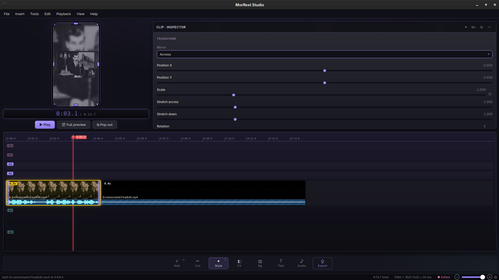
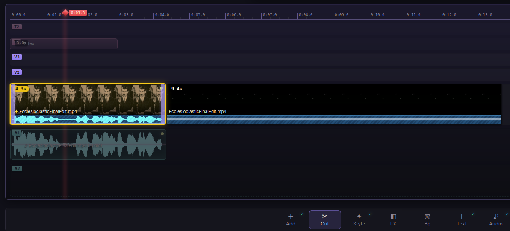
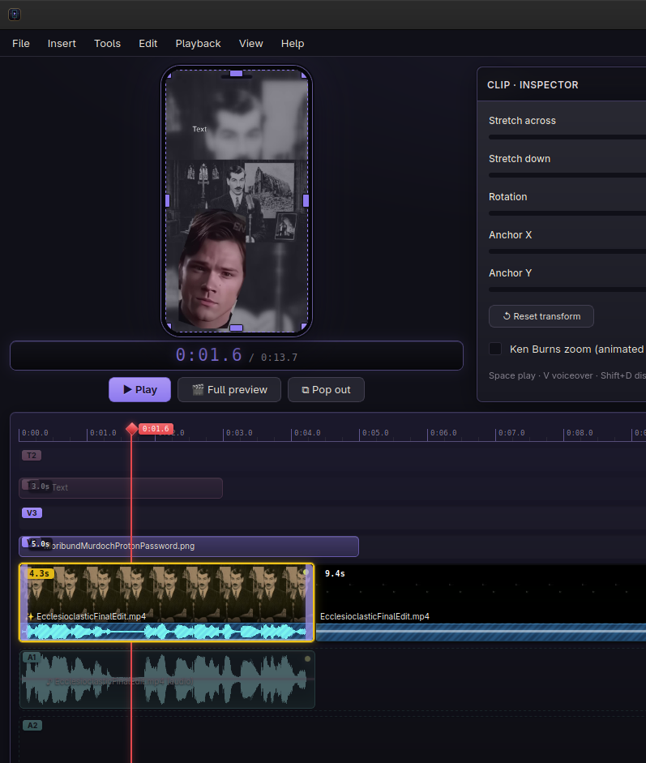
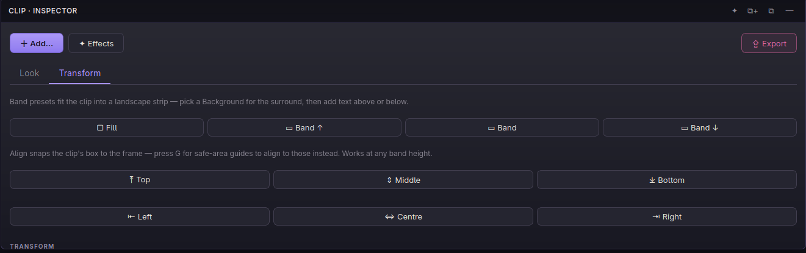
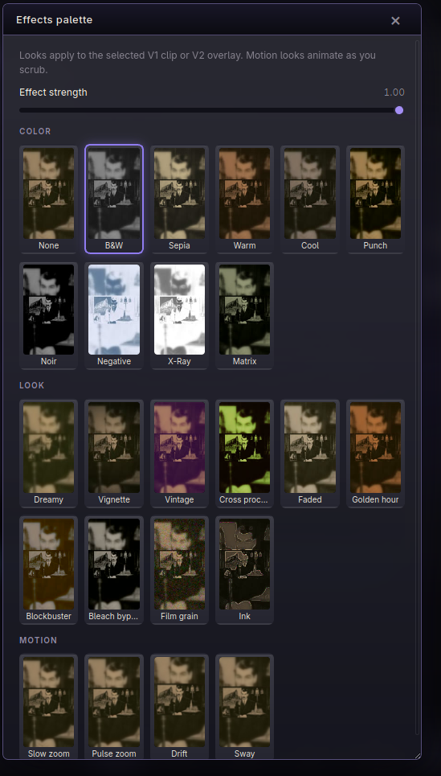
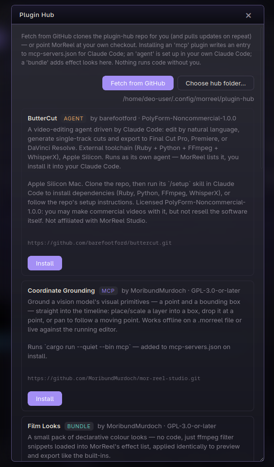

# MorReel Studio

Portrait-only (9:16) video editor for phone reels. A Rust/Dioxus desktop UI over
the system `ffmpeg`, the same shell-over-engine split kdenlive (MLT) and
openshot (libopenshot) use, minus the C++ binding layer.

Everything you scrub is what you ship: preview frames, effects, titles, and the
export all run through the same ffmpeg filter chains at 1080×1920, 30 fps.

<p align="center">
  
</p>

## Features

- **V1 main track**: trim, reorder, split at playhead, per-clip speed
  (0.25×–4×) and volume; every delete is a ripple delete by construction (a
  concat timeline has no gaps to leave). A clip with sound draws its own
  waveform under its thumbnail, so a clip with no strip is a silent one.
  **Edit › Auto-cut silence…** drops quiet stretches by volume (threshold,
  padding, selection or whole reel) via ffmpeg silencedetect.
- **Photos on the timeline**: drop a still (JPEG, PNG, HEIF/HEIC, TIFF, BMP,
  WebP, AVIF) onto V1 or V2 and it loops for as long as you hold it, so the
  Motion effects become camera moves over a photo. Same lanes, same effects,
  same export. Animated GIF lands as video (it has duration); PDF, PSD and
  camera RAW are out of scope, flatten or export to JPEG/PNG/HEIF first.
- **Disable & Solo**: FCP-style: **Shift+D** disables the selection (dimmed on
  the timeline, invisible and silent in preview/export, still keeps its span);
  **Alt+S** solos it (other audio silent, non-soloed clips in B&W). Works on V1
  clips, V2 cutaways, A-lane beds and titles (disable only).
- **Clip appearance**: FCP-style timeline zoom and film/wave layout. **Ctrl+=/**
  **Ctrl+-** zoom the timeline; the **⧉** button (status bar or View › Clip
  appearance) opens modes for wave-only, film+wave mixes, film-only, or labels,
  plus a clip height slider and “Show clip names”. **Ctrl+Alt+1…6** pick a mode;
  **Ctrl+Alt+↑/↓** resize clip height.
- **Drag and drop**: drag media in from a file manager and the lane you drop
  on decides what it becomes: a clip on V1, a cutaway on V2, music under on A1.
  The file has the final say, so audio aimed at a video lane still lands on A1
  and a video dropped on A1 contributes its soundtrack. The target lane lights
  up before you let go.
- **Reads what ffmpeg reads**: MP4/MOV/MKV/WebM/AVI/GIF/MPEG-TS and the rest
  for video; JPEG/PNG/HEIF/TIFF/BMP/WebP/AVIF (and other single-frame formats
  ffmpeg opens) for stills; MP3/M4A/WAV/FLAC/Ogg/Opus for audio. Dialog filters
  are a convenience, not a gate: every one also offers **All files**, and
  anything ffprobe can open will import, a file with no duration but a video
  stream comes in as a still.
- **Export options**: MP4 (H.264), WebM (VP9) or animated GIF; Draft /
  Balanced / High quality; 1080×1920, 720×1280 or 540×960. The edit is always
  composed at 1080×1920 and scaled once at the end of the graph, so a smaller
  export is a smaller file, not a different render. **Export frame as PNG**
  (`Ctrl+Shift+E`) writes the composed monitor at the playhead — V1, overlays,
  FX and titles — so a still grab matches what you scrub.
- **OpenTimelineIO export**: hand the timeline off to Final Cut, Resolve or
  Premiere as a `.otio` file (clips by path, cuts and caption timing intact).
  Written straight as OTIO's JSON schema, no extra dependency. One-way: the
  `.morreel` project stays the round-trip format.
- **Transform**: per-clip scale, per-axis stretch, position, rotation, mirror
  (and opacity on V2), the same set Final Cut and kdenlive expose. Drag it directly in the monitor
  (`T` toggles the handles: drag the picture to move, a corner to resize, a
  side to stretch that axis alone, the knob to rotate, hold Shift while
  rotating to snap to 15°) or type exact numbers in the inspector. Position is a fraction of the frame,
  so a transform survives an export at a different size, and an untouched clip
  adds no filter at all. On V2 it composites, so scaling a cutaway below 1
  makes it a **picture-in-picture** with V1 showing through around it.
- **Band presets + background**: one click drops a clip into a landscape
  strip (top / center / bottom) with room above or below for text, and a
  **Background** phase in the workflow bar colors the surround (black / white /
  charcoal / gray), the "landscape clip on a colored band with a caption" reel
  layout. The background fills through the same `transform_chain` pad, so
  preview and export match.
- **Framing**: how a source fills 9:16: **Crop** (cover + center-crop),
  **Blur** (the whole picture over a blurred, zoomed copy of itself, the reel
  look for landscape footage), **Fit** (letterbox on black) or **Zoom** (1.5×).
  The blur fill scales to the frame, so thumbnails aren't a smear.
- **Ken Burns zoom**: a checkbox on any V1 clip animates a slow push over its
  whole span. It's a keyframed `scale` curve compiled to the same `zoompan`
  the Motion presets use, so preview and export animate through one filter
  chain. (The underlying keyframe model is general; the zoom is the first move
  wired to a control.)
- **Transitions**: cross dissolve, dip to black/white, slide, wipe, circle or
  dissolve between V1 clips, with an adjustable length. A transition overlaps
  the two clips it joins, so the reel gets shorter by exactly its length and
  everything downstream moves with it, and scrubbing one shows the blend, not
  a cut, because the monitor composites it the same way the export does.
- **Multi-track timeline**: stack as many picture, text and audio layers as a
  reel needs:
  - **V2…V7** free-timed overlay tracks (video or photo) over magnetic **V1**.
    Higher numbers composite on top, full-frame B-roll, PiP stickers, light
    leaks, or image-over-video at the same time. Drop files onto a lane or use
    **Insert › Add video track**. Right-click **Move track up/down**.
  - **T1…T4** text tracks above the picture (titles, lower-thirds, shapes).
    Stack multiple captions; higher track wins. **Insert › Add text track**.
  - **A1…A6** audio beds under V1 (music, VO, SFX…) with mixer strips that grow
    as you add tracks. **Insert › Add audio track**.
  Preview composites every active layer in the same order as export, so what
  you scrub is what you ship. Older `.morreel` projects open as V2 + T1 + A1/A2.
- **V2+ overlays**: B-roll cutaways with their own speed and transform;
  main audio keeps playing underneath.
- **T text tracks**: drawtext-rasterized text cards on a transparent canvas.
  Any installed font (not three generics), line-up, `\n` for manual breaks,
  and a **slide-on entrance**: the card is composited with `overlay`, whose
  x/y take time expressions, so it carries on and off with the fade. Styles
  save as **presets** outside the project, so a series of reels can share one,
  and one button pushes a style onto every caption. Words can arrive **one at
  a time**: the phone-caption reveal, and the same lane draws **shapes**
  (box, ellipse, line, filled or hollow) for the times a reel needs an arrow
  or a highlight rather than a sentence. New text is **flat by default**: an
  outline carries legibility.
  Bevel is an **opt-in effect**: an optional outline and a **cameo/intaglio
  bevel** (the Krita-derived mor_cameo_emboss algorithm). The bevel exposes the same controls as
  [wearable-dictionary-designer](../wearable-dictionary-designer), which is
  where it came from: size, softness, depth, light angle and height, and
  highlight/shadow strength.
- **A1 + A2 audio tracks**: multi-bus mix under the picture (music on A1, VO
  on A2, or anything you like). Per-item trim, volume **start/end automation**,
  fade in/out, **noise reduction**, EQ treatments (Voice enhance, Warm, Bright,
  Bass cut, Podcast), compression, and **auto ducking** (sidechain compressor
  keyed off V1). Align to playhead and ±1 frame nudge for sync. Detach a V1
  clip's soundtrack onto A1 with **Ctrl+U**.
- **Beat markers** (`M`), tap along to the music while it plays and you get
  the grid you want to cut on. They snap, so dragged items land on the beat.
- **Effects**: B&W, Sepia, Warm, Cool, Punch, Dreamy, Vignette, and the
  Motion set (Slow/Pulse zoom, Drift, Sway), keyed on time, so they animate
  in the monitor as you scrub, ported from
  [moranima](../moranima)'s camera moves; one ffmpeg filter each, identical in
  preview and export, with a strength slider that interpolates to identity.
- **Grade**: a light primary colour correction in the Style › Look tab:
  exposure, contrast, saturation and warmth sliders on any V1 clip or V2
  cutaway. Runs *before* the effect look (correct first, stylise on top),
  compiles to one `eq` + `colortemperature` pass, and rides the same chain as
  everything else, so it is identical in preview and export.
- **Safe-area guides** (`G`), shaded bands showing where a phone app's own
  header, action rail and caption block sit over the frame. Worst case across
  TikTok / Reels / Shorts, so clearing them clears all three.
- **Upload-length warnings**: the status bar flags when the reel outgrows
  Shorts (60 s), Reels (90 s) or TikTok (10 min); pick a target platform in
  Project settings to check against just that one.
- **Project settings** (`Ctrl+,`), target platform, default export resolution,
  safe-area default and project title/author, saved with the `.morreel` file.
  9:16 · 30 fps is fixed, it's a portrait-reel editor, so that's shown, not
  offered.
- **Workspace layouts**: save the panel arrangement (inspector docked, floated
  or hidden) under a name, with Editing / Focus / Floating presets, plus
  fullscreen (`F11`).
- **Keyboard layout** (Help › Keyboard layout), coming from Resolve, Premiere
  or Final Cut? Match its blade key. MorReel's command set is small, so it
  remaps the one editing key that differs everywhere, split at playhead, rather than fake a whole keymap. Persisted app-wide.
- **Undo/redo** (`Ctrl+Z` / `Ctrl+Shift+Z`), whole-timeline snapshots; a
  single slider drag collapses into one step.
- **Projects**: save and reopen an edit as a small JSON file (`.morreel`).
  It records the edit, not the media: sources stay referenced by path, and
  thumbnails, proxies, waveforms and title PNGs rebuild on load. A **● Edited**
  chip in the status bar flags unsaved changes (comparing what would hit disk,
  so a background proxy landing doesn't count), and quitting with unsaved work
  asks first.
- **Snapping**: dragged overlays, audio and titles snap to clip cuts, the end
  of the reel, and the playhead.
- **Proxies**: background 480p scrub proxies (content-addressed cache) for
  smooth seeking; export always uses the originals.
- **Playback**: in-app silent proxy playback (Space), or a fast preview
  render handed to mpv/ffplay for full fidelity with audio (Ctrl+P).
- **Workflow bar**: a bottom spine of the reel-building phases (Add · Cut ·
  Style · Text · Audio · Export), the phase you're in lit up and a ✓ on phases
  that already have content. Clicking a phase **reconfigures the inspector** to
  that task's tools, Add and Export get their own panels, Cut shows a clip's
  trim/speed/transition, Style shows its effects/transform/Ken Burns, so the
  panel is organized by task, not by whatever you last clicked. The timeline
  follows too, lanes the phase doesn't touch dim back (Text spotlights the T
  lane, Audio the A lanes, Cut/Style the video). Selecting an item on the
  timeline jumps to its phase.
- **Desktop chrome**: menu bar, keyboard shortcuts, frameless/native/tiling
  window modes. Mobile (Android/iOS) builds swap the timeline for a clip pager.

## Screenshots

**Multi-track timeline** - V1 clips carry their own film strip and waveform; split at the playhead, stack text (T) and audio (A) lanes under a workflow bar that drives Add / Cut / Style / Bg / Text / Audio / Export.



**Transform in the monitor** - toggle the handles with `T`, then drag the picture to move, resize or rotate it; a V2 overlay scaled below 1 becomes a picture-in-picture over a blurred fill.



**Inspector** - band presets fit a landscape clip into a strip, alignment snaps its box to the frame, and the Look / Transform tabs hold the rest.



**Effects palette** - colour, look and motion presets with live thumbnails and one effect-strength slider; motion looks animate as you scrub.



**Plugin Hub** - a RuneLite-style manifest repo of agent, MCP and bundle plugins; fetch from GitHub and install, nothing runs code without you.



## Building

Requires Rust, `ffmpeg`/`ffprobe` on PATH, and the sibling
[`mor_rust_dioxus_ui_kit`](../mor_rust_dioxus_ui_kit) crate (path dependency, check out both under a common parent, or adjust the path in `Cargo.toml`).

```bash
cargo run              # desktop app
cargo test             # unit + end-to-end ffmpeg smoke tests
MORREEL_MOBILE=1 cargo run   # preview the mobile layout on desktop
```

## Terminal control (`morreel` CLI)

The running editor listens on `127.0.0.1:8177` for live commands (set
`MORREEL_LIVE_PORT` to move it). The `morreel` binary is a thin client for that
port, same wire protocol the MCP server's live path uses, so power users can
drive the open GUI from a shell and agents can skip an MCP client entirely.

```bash
cargo build --bin morreel        # or `cargo install --path . --bin morreel`
morreel tools                    # what plugins/tools the editor exposes
morreel items                    # V1 clips / V2 overlays and their indices
morreel place_point lane=V1 index=0 x=0.5 y=0.4
morreel place_box  lane=V2 index=1 x0=0.1 y0=0.1 x1=0.9 y1=0.9 cover=true
morreel track_point lane=V1 index=0 \
  --json '{"samples":[{"t":0,"x":0.2,"y":0.5},{"t":2,"x":0.8,"y":0.5}],"zoom":1.5}'
```

`lane`/`index` fold into the `target` the plugins expect; a value that parses as
JSON is sent typed, otherwise as a string; `--json` passes a full params object
for anything the flat args can't express (like `samples`). Every command lands on
the same undo stack a GUI edit does. Offline `.morreel` editing (for agents that
prefer files over a live app) is the separate `mcp` binary / MCP server.

## License

GPL-3.0-or-later, see [LICENSE](LICENSE).

Copyleft lineage: `src/bevel.rs` is the Intaglio/Cameo bevel from
wearable-dictionary-designer (GPL-2.0-or-later), itself derived from Krita's
`kis_ls_bevel_emboss_filter.cpp` by Dmitry Kazakov via the mor_cameo_emboss
GIMP plugin. That file remains GPL-2.0-or-later; the combined work is
distributed under GPL-3.0-or-later, in the same family as the projects this
editor takes inspiration from (kdenlive, OpenShot, smplayer). FFmpeg is
invoked as an external process, not linked.
